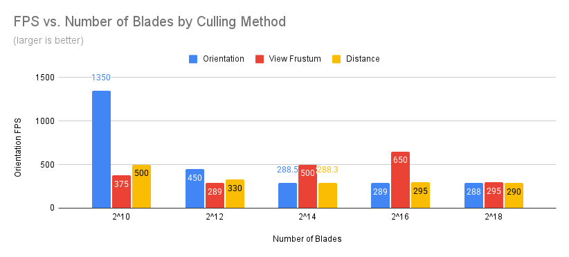

Vulkan Grass Rendering
==================================

**University of Pennsylvania, CIS 565: GPU Programming and Architecture, Project 5**

* Caroline Fernandes
  * [LinkedIn](https://www.linkedin.com/in/caroline-fernandes-0-/), [personal website](https://0cfernandes00.wixsite.com/visualfx)
* Tested on: Windows 11, i9-14900HX @ 2.20GHz, Nvidia GeForce RTX 4070

### Overview

The goal of this project was to get comfortable with Vulkan and implement [Responsive Real-Time Grass Rendering for General 3D Scenes](https://www.cg.tuwien.ac.at/research/publications/2017/JAHRMANN-2017-RRTG/JAHRMANN-2017-RRTG-draft.pdf). I am responsible for implementing the grass vertex, grass tessellation control/evaluate, grass fragment, and compute shaders.

In order to build the project, I made updates to CMakeLists.txt and updated the glfw folder to pull in the most recent from this repository https://github.com/glfw/glfw

 

## Grass Rendering
Each blade was represented by a bezier curve and three control points. De Castelajau's algorithm was used to construct the curve, and generate the triangle representation.

 

**Note:** Values have been adjusted for the remaining videos to show off the effect

## Simulating Forces
These forces were summed and applied in the compute shader of the pipeline.

### Gravity
Gravity is implemented as the summation of environmental and "front" facing gravity (which is applied to the front viewing vector of the blade). 

 

### Recovery

Recovery acts as a targeting force to bring the blade back to its starting position. The paper includes collisions, but my implementation was just influenced by the v2's current position, starting position, and a stiffness coefficient.

### Wind

I simulated wind to be the combination of a wind direction and wind alignment. Blades with a forward vector aligned with the wind direction received more of an impact from the wind. Sin and Cosine waves that change over time were used to produce the waves.

 

## Culling

### Orientation Culling
Culls the blades with a front vector pointing away from the camera's look vector, because the width will become zero and rendering these pixels will produce rendering artifacts.

 

### View Frustum Culling
Culls the blades that fall outside of the viewing frustum as they will not be visible.

 

### Distance Culling
Culls the blades that are outside a defined range from the camera.

 

## Performance Analysis
I tested using values suggested by the paper, however, the performance results did not match my expectations. Further turning of the parameters could reveal more obvious trends.

Culling Impact

 

I tested different scene sizes with all three culling effects applied and compared that without those optimizations. This result was perhaps the most confusing, I had assumed the benefits of culling would outweigh the costs. In smaller scenes especially the opposite was true. In larger scenes the two results were comparable.

Culling Technique Breakdown

 

Culling by blade orientation seemed to have the largest impact with smaller scenes, whereas with larger scenes the viewing frustum optimization seemed to be the most impactful.
